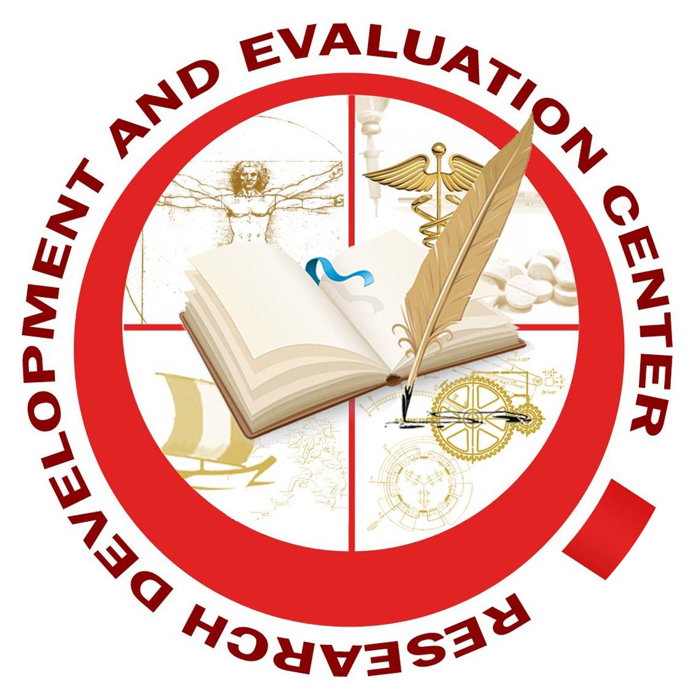
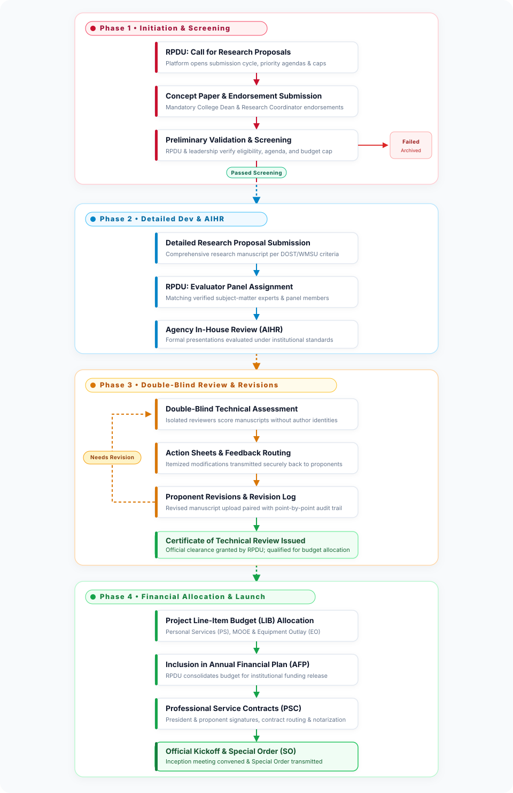
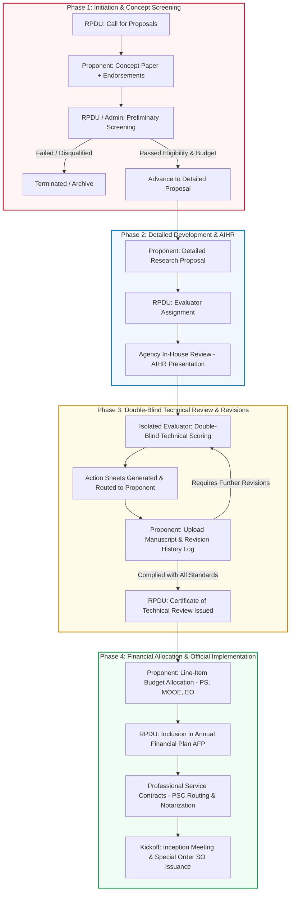

<div align="center">

  
  &nbsp;&nbsp;&nbsp;&nbsp;&nbsp;&nbsp;
  

  # WMSU Research Project Development System
  ### Research Development and Extension Center (RDEC) &bull; Research Project Development Unit (RPDU)
  **Western Mindanao State University &mdash; Zamboanga City, Philippines**

  <p align="center">
    A standardized, transparent, and digitized platform built to govern the institutional research proposal lifecycle&mdash;from initial concept screening and double-blind review to budget clearance and contract execution.
  </p>

  [](https://react.dev/)
  [](https://www.typescriptlang.org/)
  [](https://vitejs.dev/)
  [](https://tailwindcss.com/)
  [](https://gsap.com/)

</div>

---

## Table of Contents

- [About The Project](#about-the-project)
- [Project Description](#project-description)
- [System Abstract & Workflow Lifecycle](#system-abstract--workflow-lifecycle)
  - [Workflow Diagram](#workflow-diagram)
  - [Phase 1: Initiation and Concept Screening](#phase-1-initiation-and-concept-screening)
  - [Phase 2: Detailed Development and AIHR](#phase-2-detailed-development-and-aihr)
  - [Phase 3: Double-Blind Technical Review and Revisions](#phase-3-double-blind-technical-review-and-revisions)
  - [Phase 4: Financial Allocation and Official Implementation](#phase-4-financial-allocation-and-official-implementation)
- [System User Roles](#system-user-roles)
- [Key Features](#key-features)
- [Technology Stack](#technology-stack)
- [Project Directory Structure](#project-directory-structure)
- [Getting Started](#getting-started)
  - [Prerequisites](#prerequisites)
  - [Installation](#installation)
  - [Environment Variables](#environment-variables)
  - [Running the App](#running-the-app)
- [The Development Team](#the-development-team)
- [Institutional Attribution](#institutional-attribution)

---

## About The Project

This application is developed as an academic capstone and final requirement for the **Software Engineering** course by a team of five (5) **Bachelor of Science in Computer Science (BSCS)** students at **Western Mindanao State University (WMSU)**.

In collaboration with the operational framework of the **Research Development and Extension Center (RDEC)** and the **Research Project Development Unit (RPDU)**, this project translates the university's institutional research governance guidelines into an automated, role-secured web platform.

---

## Project Description

The **WMSU Research Project Development System** is a digitized platform designed to streamline and govern the submission, evaluation, and approval lifecycle of institutional research proposals. Built to strictly enforce the official **2026 Research Project Development process flow**, the system transitions traditional paper-based endorsements, double-blind reviews, and contract routing into a centralized, structured digital environment.

It ensures operational accountability, enforces strict evaluation limits, and creates a seamless, transparent pipeline between university researchers and the Research Project Development Unit (RPDU).

---

## System Abstract & Workflow Lifecycle

The system operates on a linear, highly controlled workflow divided into **four primary phases**. It moves a research initiative from a conceptual idea to an officially funded and implemented university project.

### Workflow Diagram

<p align="center">
  
</p>

<details>
<summary><b>Click to expand raw Mermaid flowchart source</b></summary>



</details>

### Phase 1: Initiation and Concept Screening
- **Call for Proposals**: The cycle begins when the RPDU officially opens and disseminates a call for research proposals through the platform, complete with fiscal year limits, thematic priorities, and submission deadlines.
- **Concept Submission**: Proponents submit their initial concept papers, ensuring they include mandatory digital endorsements from their respective College Deans and Research Coordinators.
- **Preliminary Validation**: The RPDU consolidates these submissions by research agenda and budget, and designated reviewers conduct preliminary screening. Approved concepts advance to the next stage, while non-compliant concepts are halted.

### Phase 2: Detailed Development and AIHR
- **Detailed Submission**: Proponents whose concept papers pass the preliminary screening are required to submit a comprehensive, detailed research proposal adhering to university and DOST formatting guidelines.
- **Agency In-House Review (AIHR)**: The system manages the assignment of evaluators who assess the proposal based on strict institutional criteria during formal AIHR presentations.

### Phase 3: Double-Blind Technical Review and Revisions
- **Technical Assessment**: The RPDU assigns specialized evaluators to conduct a double-blind technical review of the detailed proposals, ensuring bias-free appraisal.
- **Iterative Revisions**: Evaluator feedback (Action Sheets) is routed back to the proponents. Proponents address the feedback by uploading revised manuscripts and documenting their changes via a structured **Revision History log**. This feedback loop continues until the proposal satisfies all technical standards.
- **Technical Clearance**: Once revisions are validated, the RPDU issues an official **Certificate of Technical Review**, clearing the project for funding eligibility.

### Phase 4: Financial Allocation and Official Implementation
- **Budgeting**: The system captures the detailed Project Line-Item budget allocations (Personal Services, MOOE, Equipment Outlay) required for inclusion in the **Annual Financial Plan for Research Projects**.
- **Contract Processing**: Professional Service Contracts (PSCs) are prepared by the RPDU, signed by the University President and proponents, and tracked until legally notarized.
- **Project Kickoff**: The digital workflow concludes with the scheduling of an **Inception Meeting** and the forwarding of a request for a **Special Order (SO)** designation to the Office of the President.

---

## System User Roles

To maintain security, privacy, and operational integrity, the platform enforces strict role-based access control (RBAC):

| Role | Responsibility | Scope of Access |
| :--- | :--- | :--- |
|  **Proponent** | University faculty & researchers | Submit concept papers, upload Dean endorsements, provide detailed manuscripts, address Action Sheets with revision logs, and submit line-item budgets. |
|  **Evaluator** | Subject-matter experts & panel reviewers | Isolated, double-blind access to assigned proposals. Review criteria, submit technical scores, and issue actionable modification sheets without access to researcher identities. |
|  **RPDU** | Research Project Development Unit Officers | Open/close Calls for Proposals, conduct preliminary screening, assign evaluators, monitor review cycles, verify revision compliance, issue Certificates of Technical Review, and route PSC contracts. |
|  **Admin** | System Overseers & Platform Administrators | Manage user accounts, role allocations, system health, audit logs, and override operational bottlenecks if administrative intervention is required. |

---

## Key Features

-  **Dynamic Calls for Proposals**: Centralized dissemination of funding calls with countdown timers, priority areas, grant ceilings, and downloadable institutional memo attachments.
-  **Digital Concept Endorsements**: Mandatory upload and verification of College Dean and Research Coordinator endorsements to maintain chain of command.
-  **Double-Blind Evaluation Architecture**: Complete anonymization of proposal documents during technical review to eliminate reviewer bias.
-  **Revision Tracking & Action Sheets**: Interactive action sheet feedback routing where proponents provide point-by-point compliance logs before clearance.
-  **Line-Item Budget Allocation (LIB)**: Form-based and document-assisted budget builder for Personal Services (PS), Maintenance & Other Operating Expenses (MOOE), and Equipment Outlay (EO) aligned with DOST Form 1b standards.
-  **Contract & Clearance Pipeline**: Automated tracking of Certificates of Technical Review, Professional Service Contracts (PSC), and President's Special Orders.
-  **Real-time Notifications & Toast Alerts**: Instant system updates on proposal transitions, evaluator assignments, and revision requests.

---

## Technology Stack

### Frontend Architecture (Client Application)
- **Core Framework:** [React 19](https://react.dev/) with [TypeScript](https://www.typescriptlang.org/) for robust, type-safe interface components.
- **Build System:** [Vite 6](https://vitejs.dev/) providing rapid Hot Module Replacement (HMR) and optimized distribution builds.
- **Styling & Design System:** [Tailwind CSS v4](https://tailwindcss.com/) for fluid, responsive utility layouts.
- **Iconography:** [Lucide React](https://lucide.dev/) and custom vector iconography.
- **Micro-Interactions & Motion:** [GSAP (GreenSock Animation Platform)](https://gsap.com/) for sleek transition mechanics.
- **Client Routing:** [React Router v7](https://reactrouter.com/) with role-guarded route trees.

### Backend Strategy & Service Integration
- **Decoupled Client-Server Architecture:** This repository encompasses the dedicated frontend presentation and business-client workflows.
- **Protected Service Governance:** To comply with institutional data privacy policies and university security regulations, backend business logic, database configurations, and server microservices reside within a separate, privately managed repository.
- **Secure API Interoperability:** Communicates with backend endpoints via standardized RESTful service adapters, environment configuration tokens, and secure session handling.

---

## Project Directory Structure

```text
wmsu-rdec/
├── .github/
│   └── assets/                 # Repository documentation assets, diagrams & animations
├── public/                     # Static production assets, branding seals, and official templates
└── src/                        # Main frontend application source code
    ├── components/             # Reusable UI component library (navigation, modals, toast alerts, buttons)
    ├── context/                # Global React state management (Authentication and Proposal Call contexts)
    ├── data/                   # Initial seeds, mock datasets, and campus structural definitions
    ├── layouts/                # Role-scoped layout wrappers (Admin, RPDU, Proponent, and Public layouts)
    ├── lib/                    # Client API initializations, authentication utilities, and helpers
    ├── pages/                  # Role-partitioned page views and workflow stages
    │   ├── admin/              # Administrative control center and system governance dashboards
    │   ├── auth/               # User authentication, credential sign-in, and account registration
    │   ├── evaluator/          # Isolated, double-blind evaluation workspaces and rubric scoring
    │   ├── proponents/         # Researcher portal, proposal submission, and line-item budgeting
    │   ├── rpdu/               # RPDU operational control, call disseminator, and contract tracker
    │   └── screening/          # Preliminary concept validation and compliance screening workflows
    └── types/                  # TypeScript interface definitions, domain models, and system contracts
```

---

## Getting Started

### Prerequisites

Ensure you have the following installed on your local machine:
- **Node.js** (v18.0.0 or higher recommended)
- **npm** (v9.0.0 or higher) or **yarn** / **pnpm**
- Backend service endpoints configured via environment variables

### Installation

1. **Clone the repository:**
   ```bash
   git clone https://github.com/RALPH22222/wmsu-rdec.git
   cd wmsu-rdec
   ```

2. **Install project dependencies:**
   ```bash
   npm install
   ```

### Environment Variables

Create a `.env` file in the root directory by duplicating `.env.example`:

```bash
cp .env.example .env
```

Populate the `.env` file with your API connection variables:

```env
VITE_SUPABASE_URL=https://your-project-ref.supabase.co
VITE_SUPABASE_ANON_KEY=your-supabase-anon-key
```

### Running the App

- **Start Development Server:**
  ```bash
  npm run dev
  ```
  The development server will launch locally at `http://localhost:5173`.

- **Build for Production:**
  ```bash
  npm run build
  ```

- **Preview Production Build:**
  ```bash
  npm run preview
  ```

- **Lint Codebase:**
  ```bash
  npm run lint
  ```

---

## The Development Team

This system was designed, built, and tested by **5 Computer Science students** for the **Software Engineering** subject at **Western Mindanao State University**:

<p align="center">
  
</p>

<p align="center">
  <a href="https://github.com/RALPH22222"><b>Chex</b> (@RALPH22222)</a> &bull;
  <a href="https://github.com/dhaifzz"><b>Dhaif</b> (@dhaifzz)</a> &bull;
  <a href="https://github.com/Eiseu01"><b>Ace</b> (@Eiseu01)</a> &bull;
  <a href="https://github.com/vodh1"><b>Andrei</b> (@vodh1)</a> &bull;
  <a href="https://github.com/dianacast6"><b>Diana</b> (@dianacast6)</a>
</p>

---

## Institutional Attribution

- **University:** [Western Mindanao State University](https://wmsu.edu.ph/) (WMSU), Normal Road, Baliwasan, Zamboanga City, Philippines
- **Administrative Center:** Research Development and Extension Center (RDEC)
- **Supervisory Unit:** Research Project Development Unit (RPDU)
- **Program:** College of Science and Mathematics &bull; Department of Computer Science
- **Course Subject:** Software Engineering

---

<div align="center">
  <sub>Developed with pride for the research community of Western Mindanao State University.</sub>
</div>
